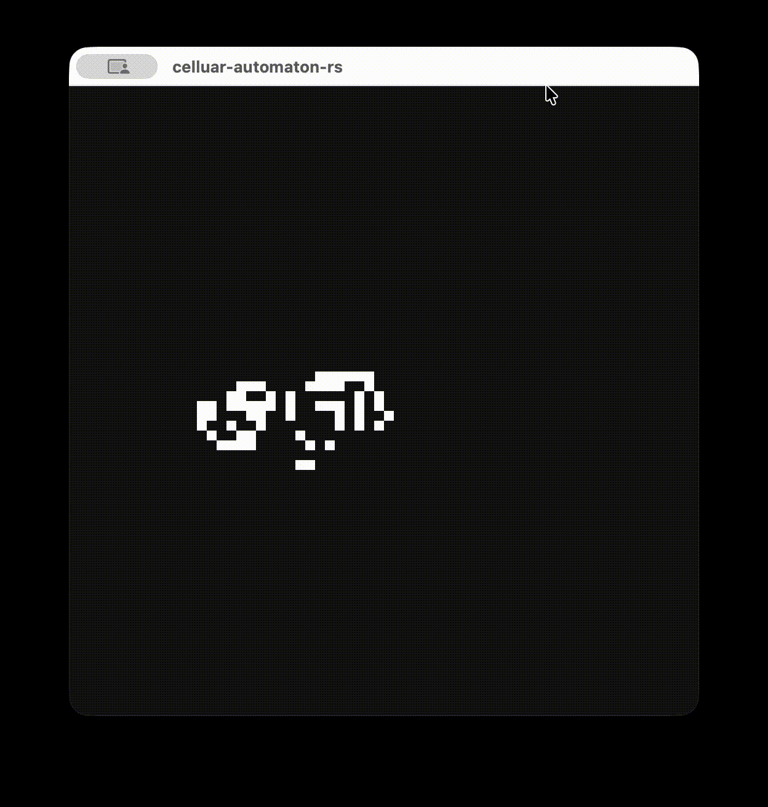

# celluar-automaton-rs

A high-performance interactive simulator for cellular automata written in Rust, using _minifb_ for real-time rendering. Currently supports two classic automata:

- _Conway's Game of Life_ – the iconic zero-player game where patterns emerge from simple rules.
- _Langton's Ant_ – a Turing-complete automaton with an ant that moves on a grid, changing cell colors.

<p align="center">
    
</p>

## Features

- _Two automata_ – choose between Conway and Langton's Ant at startup.
- _Real-time editing_ – draw living/dead cells with mouse clicks while in Editing mode.
- _Smooth simulation_ – toggle between Editing and Running modes with the Spacebar.
- _Fully configurable_ – set grid dimensions, pixel scale, and target FPS via command line arguments.
- _Performance_ – uses efficient grid storage and minimal dependencies.
- _Visual feedback_ – the ant's cursor is highlighted in red when using Langton's Ant.

## Installation

Make sure you have Rust installed (edition 2021 or later). Then clone the repository and build the project:

```bash
git clone https://github.com/teyoku/celluar-automaton-rs.git
cd celluar-automaton-rs
cargo build --release
```

The executable will be available at `target/release/celluar-automaton-rs`.

## Usage

Run the program with the following command-line arguments:

```bash
cargo run -- <automaton> <width> <height> <scale> <fps>
```

| Argument    | Description                                                                            |
| ----------- | -------------------------------------------------------------------------------------- |
| `automaton` | Which automaton to use: `conway` or `langton`                                          |
| `width`     | Number of cells horizontally (positive integer)                                        |
| `height`    | Number of cells vertically (positive integer)                                          |
| `scale`     | Pixel size of each cell (positive integer, e.g., `10` means each cell is 10×10 pixels) |
| `fps`       | Target frames per second (positive integer, limits simulation speed)                   |

## Example

Start Conway's Game of Life on a 64×64 grid, with each cell scaled to 8 pixels, running at 30 FPS:

```bash
cargo run -- conway 64 64 8 30
```

For Langton's Ant on a 100×100 grid, scale 5, at 60 FPS:

```bash
cargo run -- langton 100 100 5 60
```

## Controls

| Key/Button         | Action                                                                                 |
| ------------------ | -------------------------------------------------------------------------------------- |
| `Esc`              | Exit the program                                                                       |
| `Space`            | Toggle between _Editing_ (pause) and _Running_ (simulation) modes                      |
| Left mouse button  | In Editing mode: set the clicked cell to _alive_ (for Conway) or _black_ (for Langton) |
| Right mouse button | In Editing mode: set the clicked cell to _dead_ (for Conway) or _white_ (for Langton)  |

> _Note:_ In Running mode, mouse clicks are ignored to prevent accidental modifications during simulation.

## Project Structure

- `main.rs` – entry point, argument parsing, window creation.
- `cli.rs` – command-line argument parsing logic.
- `config.rs` – configuration structures (`AutomatonKind`, `AppConfig`).
- `error.rs` – custom error types and formatting.
- `automaton.rs` – defines the `Automaton` trait.
- `automaton_selector.rs` – enum wrapper for the two automata, delegating calls.
- `automaton/conway.rs` & `automaton/langton.rs` – implementations of Conway's Game of Life and Langton's Ant.
- `cell.rs` – cell state and color definitions.
- `grid.rs` – generic 2D grid container.
- `renderer.rs` – main rendering loop, buffer update, mouse handling.
- `utils.rs` – helper functions (neighbor counting, coordinate iteration).

## Dependencies

- [minifb](https://crates.io/crates/minifb) – lightweight window and framebuffer handling.

## License

This project is open-source and available under the MIT License. Feel free to use, modify, and distribute it as you like.